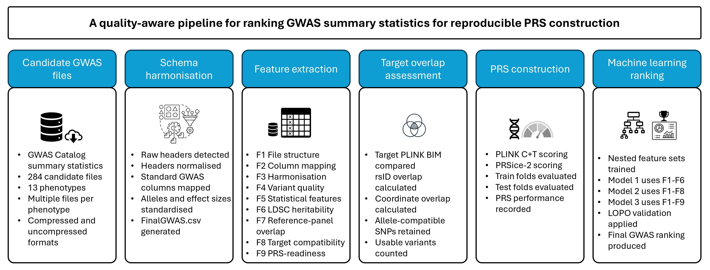

# GWASRanker

GWASRanker is a research pipeline for discovering, harmonising, characterising,
and ranking genome-wide association study (GWAS) summary-statistics datasets
for downstream polygenic risk score (PRS) analysis.

The repository contains scripts for:

- discovering and downloading GWAS summary statistics;
- profiling file formats and schema variation;
- creating a harmonised GRCh38 `FinalGWAS.csv`;
- calculating nine groups of GWAS quality and readiness features;
- evaluating target-genotype compatibility;
- running PRS workflows with PLINK and PRSice-2;
- merging performance results across GWAS datasets;
- training and evaluating GWAS-ranking models.



## Repository Status

GWASRanker is research software under active development. The scripts reflect
the analysis pipeline used by the project and may require configuration for a
new compute environment.

The repository intentionally excludes:

- downloaded GWAS summary statistics;
- genotype and participant-level data;
- reference panels and LDSC resources;
- PLINK and PRSice-2 binaries;
- generated feature, PRS, and model output files.

## Pipeline Overview

| Stage | Main scripts | Purpose |
|---|---|---|
| Discovery | `Module1-*` to `Module3-*` | Find, inspect, and download GWAS files |
| Extraction | `Module4-*`, `Module5-*` | Extract GWAS tables and inspect PRS columns |
| Feature generation | `Variation1.py` to `Variation9.py` | Calculate file, statistical, reference, target, and PRS-readiness features |
| Harmonisation | `Variation3.1-Manualcheck.py` | Produce the standardised `FinalGWAS.csv` handoff file |
| Feature merging | `Variation*-Allfeatures.py`, `AllFeatures-PRS-Merge.py` | Merge per-GWAS feature outputs |
| PRS evaluation | `PRS1-Calculation-Plink.py`, `PRS1-Calculation-PRSice-2.py` | Evaluate PRS performance across target-data folds |
| PRS merging | `PRS2-Calculation-Merge.py` | Merge PLINK and PRSice-2 performance and failure reasons |
| Ranking analysis | `Analysis19-*` to `Analysis22-*` | Generate datasets, train ranking models, and compare performance |

## Requirements

### Python

The recommended environment uses Python 3.10:

```bash
conda env create -f environment.yml
conda activate gwasranker
```

Alternatively:

```bash
python -m venv .venv
source .venv/bin/activate
pip install -r requirements.txt
```

On Windows PowerShell, activate the virtual environment with:

```powershell
.\.venv\Scripts\Activate.ps1
```

### External tools and resources

Some stages require resources that must be installed or supplied separately:

- [PLINK 1.9](https://www.cog-genomics.org/plink/)
- [PLINK 2](https://www.cog-genomics.org/plink/2.0/)
- [PRSice-2](https://choishingwan.github.io/PRSice/)
- GWASLab-compatible dbSNP and HapMap references
- LDSC reference LD scores
- target genotype data organised into phenotype and fold directories

Several scripts currently contain cluster-oriented default paths. Override
paths through the available command-line arguments or update the constants for
your environment before running those stages.

## Expected Data Layout

The main per-GWAS workflow is driven by `GWAS_jobs.csv`. Each selected GWAS is
stored beneath a phenotype directory:

```text
<phenotype>/
  allgwas/
    <accession>/
      <downloaded GWAS file>
      FinalGWAS.csv
      Feature1.csv
      ...
      Feature9.csv
      PRS/
```

Target genotype folds are expected separately:

```text
<target-data-root>/
  <phenotype>/
    Fold_0/
      train_data.QC.bed
      train_data.QC.bim
      train_data.QC.fam
      test_data.bed
      test_data.bim
      test_data.fam
    ...
```

Do not commit any of these data files to GitHub.

## Typical Workflow

### 1. Discover and download GWAS files

```bash
python Module1-SearchPhenotypeandPopulation.py
python Module2-Search_Poke_Normalize_Scan.py
python Module3-DownloadGWAS.py
```

Use each script's `--help` output for its current arguments:

```bash
python Module1-SearchPhenotypeandPopulation.py --help
```

### 2. Generate a complete harmonised GWAS

`Variation3.1-Manualcheck.py` standardises the full GWAS and writes
`FinalGWAS.csv`:

```bash
python Variation3.1-Manualcheck.py 1 --full-file
```

### 3. Calculate downstream features

```bash
python Variation4.py 1 --force
python Variation5.py 1 --force
python Variation6.py 1 --force
python Variation7.py 1 --force
python Variation8.py 1
python Variation9.py 1
```

### 4. Merge feature outputs

```bash
python Variation4-Allfeatures.py
python Variation5-Allfeatures.py
python Variation6-Allfeatures.py
python Variation7-Allfeatures.py
python Variation8-Allfeatures.py
python Variation9-Allfeatures.py
python AllFeatures-PRS-Merge.py
```

### 5. Run and merge PRS performance

```bash
python PRS1-Calculation-Plink.py 1
python PRS1-Calculation-PRSice-2.py 1
python PRS2-Calculation-Merge.py
```

For binary phenotypes, PRS performance is evaluated using AUC. For continuous
phenotypes, the scripts store explained variance as R2.

### 6. Build and train ranking models

```bash
python Analysis19-GenerateData1.py
python Analysis19-GenerateData2.py
python Analysis19-GenerateData3.py

python Analysis20-TrainModel1.py
python Analysis20-TrainModel2.py
python Analysis20-TrainModel3.py

python Analysis21-FinalRankerModel1.py
python Analysis21-FinalRankerModel2.py
python Analysis21-FinalRankerModel3.py
```

The three model datasets use:

- Model 1: Features 1-6
- Model 2: Features 1-8
- Model 3: Features 1-9

## Outputs

Important generated outputs include:

- `FinalGWAS.csv`: harmonised per-GWAS summary statistics;
- `Feature1.csv` to `Feature9.csv`: per-GWAS feature groups;
- `Feature1_All.csv` to `Feature9_All.csv`: merged feature groups;
- `PRS2_All_GWAS_Performance_Comparison.csv`: one-row-per-GWAS PRS comparison;
- `AllFeatures_PRS_Merged.csv`: combined features and PRS performance;
- `Model1/`, `Model2/`, and `Model3/`: model-ready data and results.

These outputs are ignored by Git because they can be large and may contain
research data.

## Reproducibility and Safety

- Review cluster-specific defaults before running the pipeline.
- Keep participant-level and licensed reference data outside the repository.
- Inspect generated failure-reason columns when PRS or feature jobs do not
  complete.
- Validate harmonised alleles, genome build, and sample metadata before using
  `FinalGWAS.csv` for downstream analyses.

## Citation

Citation metadata are provided in `CITATION.cff`. Replace the placeholder
author and repository URL before publishing the repository.

## License

GWASRanker is released under the MIT License. See `LICENSE` for details.
